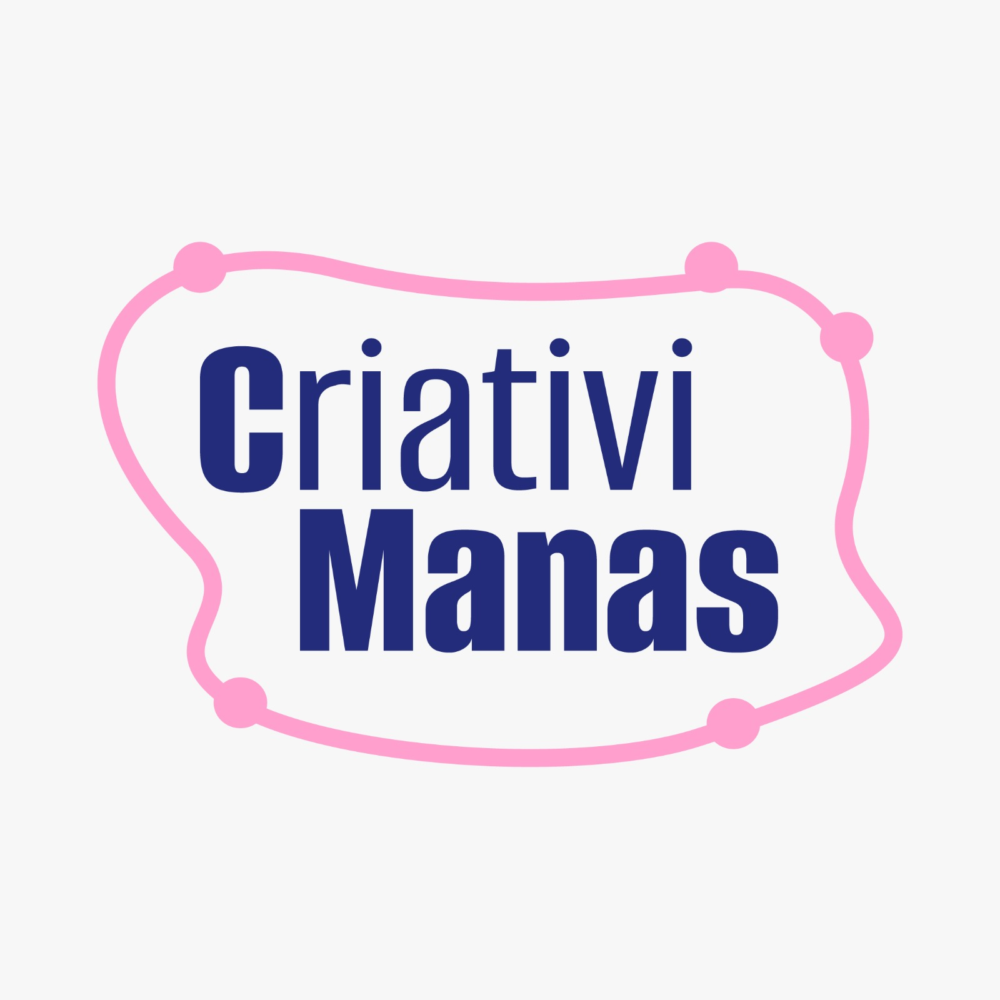
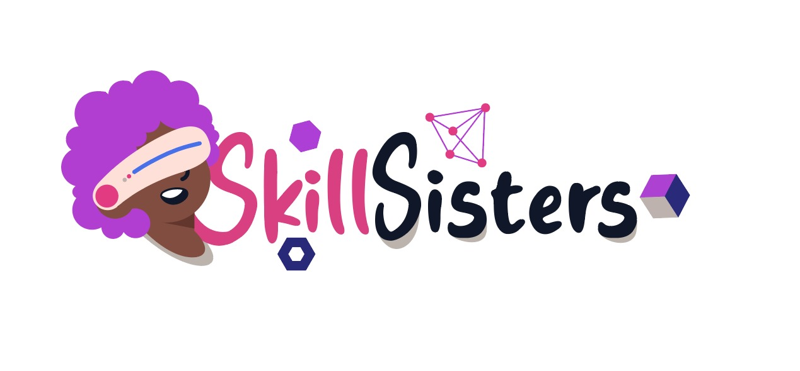

# SkillSisters :raised_hands:

Projeto criado durante o [Hackaton das Manas - 3ª edição](https://www.hackathondasmanas.com/p%C3%A1gina-inicial)   
21 e 22 de outubro de 2023

SkillSisters é uma plataforma para reunir mulheres (cis e trans), com mais de 18 anos, que estão ou desejam ingressar na carreira de tecnologia. Um ambiente de tecnologia onde mulheres se sintam valorizadas, respeitadas e capacitadas, e onde possam contribuir plenamente para a inovação e o progresso tecnológico.  

Equipe: 
:octocat: [Ana Cotta](https://github.com/draanacotta) 
:octocat: [Ana Ruth Soares](https://github.com/anaruth-13) 
:octocat: [Erica Sousa](https://github.com/ERICASSOUSA)  
:octocat: [Joice Oliveira](https://github.com/JoiceO)  
:octocat: [Lucivânia Ventura](https://github.com/lucivania-ventura)  
:octocat: [Thais Souza](https://github.com/thaixs)  

    
    

 

